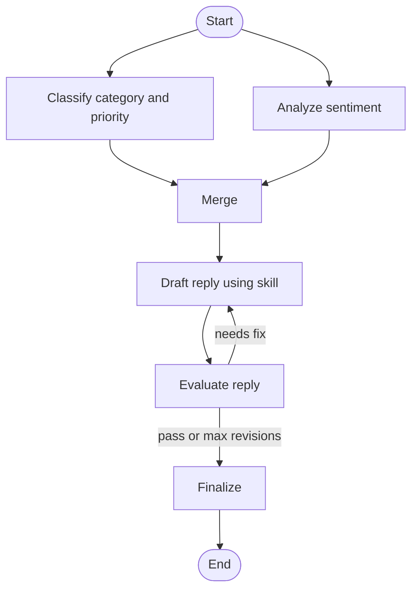

# Lab 4 Workflow Graph

```mermaid
graph TD
    START([Start]) --> classify[Classify category and priority]
    START --> sentiment[Analyze sentiment]
    classify --> merge[Merge]
    sentiment --> merge
    merge --> draft[Draft reply using skill]
    draft --> evaluate[Evaluate reply]
    evaluate -->|pass or max revisions| finalize[Finalize]
    evaluate -->|needs fix| draft
    finalize --> END([End])
```
